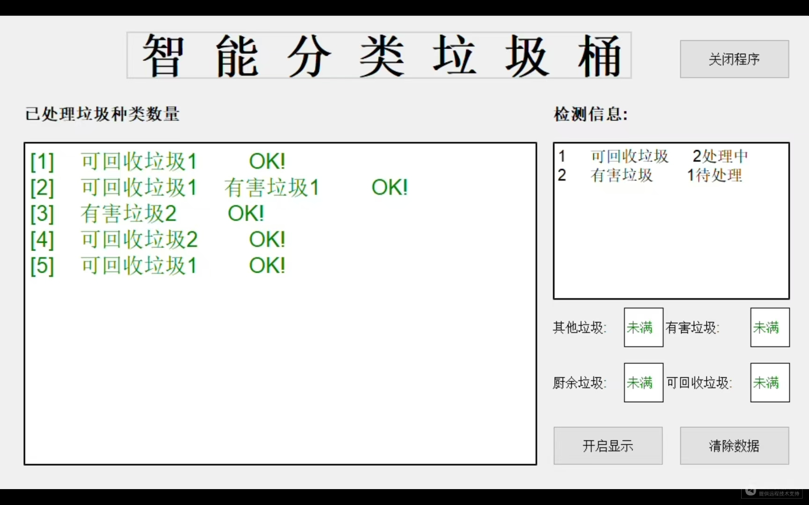
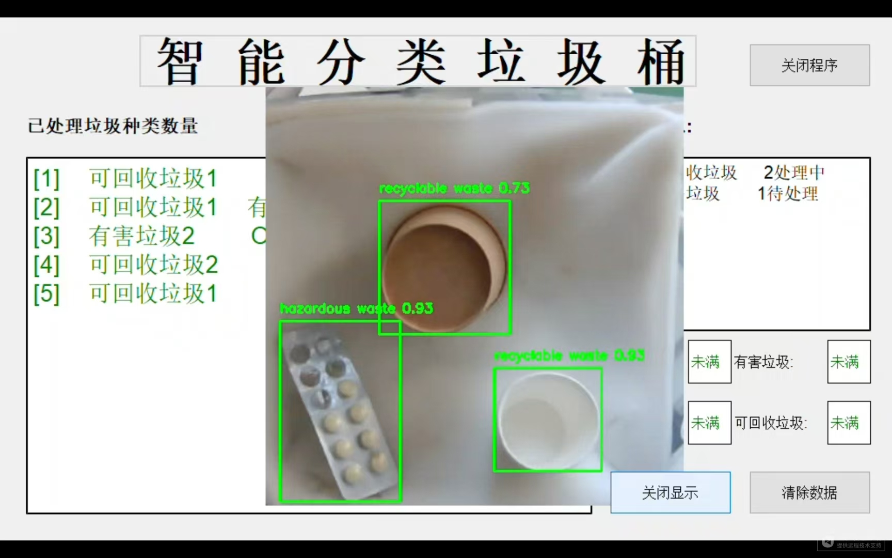

# 智能垃圾分类系统

## 项目概述
本项目是一个集计算机视觉、深度学习和机器人控制于一体的智能垃圾分类系统，实现了垃圾的自动识别、分类和回收处理全过程。系统通过摄像头实时捕获垃圾图像，利用YOLOv5深度学习模型进行精准分类识别，并通过串口通信控制机械臂完成垃圾抓取和投放操作。整个系统采用PyQt5构建了直观的全屏用户界面，实时展示垃圾处理状态、满载监控和统计信息。


## 核心功能

### 实时垃圾识别与分类
- 基于YOLOv5模型实现四类垃圾的精准识别：
  - **可回收垃圾**（如塑料瓶、纸张）
  - **有害垃圾**（如电池、药品）
  - **厨余垃圾**（如食物残渣）
  - **其他垃圾**（如陶瓷碎片）
- 优化目标检测算法，确保多目标同时识别的准确性
- 实时显示识别结果和置信度

### 机器人控制与协同操作
- 实现摄像头坐标系到机器人坐标系的精确转换
- 通过串口通信控制机械臂运动轨迹
- 智能抓取策略（基于目标位置和方向自动调整）
- 机械臂动作序列优化，提高分拣效率

### 智能状态监控系统
- 四类垃圾桶满载状态实时检测与显示
- 垃圾处理进度可视化（待处理/处理中/已完成）
- 历史处理数据统计与分析
- 异常状态预警提示

### 用户交互界面
- 全屏显示模式优化操作体验
- 双模式显示：实时视频流与检测信息同屏展示
- 一键功能控制：显示切换、数据清除、程序退出
- 响应式设计适配不同显示设备

### 开发者参数
- 开启/关闭待机视频播放
- 开启/关闭全屏化界面
- 开启/关闭摄像头监控
- 切换信息发送端（串口/控制台）
- 切换信息输入端（串口/键盘）

## 系统架构
```
图像采集 → 目标检测 → 坐标转换 → 机器人控制
            ↑           ↑
用户界面 ← 状态监控 ← 满载检测
```

## 安装指南

### 环境要求
- Python 3.8+
- PyTorch 1.7+
- OpenCV 4.5+
- PyQt5
- PySerial

### 安装步骤
1. 克隆仓库：
   ```bash
   git clone https://github.com/yourusername/smart-waste-classification.git
   ```
2. 安装依赖：
   ```bash
   pip install -r requirements.txt
   ```
3. 下载预训练模型：
   - 将YOLOv5模型文件`best.pt`放入项目根目录
4. 连接硬件设备：
   - USB摄像头
   - 机械臂控制器（通过COM5接口）

## 使用说明

### 启动系统
```bash
python main.py
```

### 操作流程
1. **系统初始化**：自动检测摄像头和机械臂连接状态
2. **垃圾识别**：将垃圾放置在摄像头视野范围内
3. **自动分类**：系统识别后生成处理队列
4. **机械臂操作**：自动完成垃圾抓取和分类投放
5. **状态监控**：界面实时更新垃圾桶状态和处理进度

### 界面功能
- **主显示区**：实时显示摄像头画面/检测结果
- **检测信息面板**：展示待处理垃圾列表和状态
- **垃圾桶状态面板**：四类垃圾桶满载指示灯
- **控制按钮**：
  - 显示切换：在摄像头画面和检测结果间切换
  - 数据清除：重置统计信息
  - 程序退出：安全关闭系统

### 训练自己的模型
1. **数据集创建**：可使用拍照程序拍摄自己的数据集
2. **数据标注**：自行标注数据集，确保数据质量
3. **模型训练**：使用训练脚本进行yolov5模型训练
4. **测试模型准确度**：可使用检测脚本进行模型测试
5. **其他工作**：使用附带程序进行手眼标注，并生成标定参数

## 技术亮点
- **多进程架构**：分离图像处理和机械控制逻辑，提升系统响应速度
- **智能防抖算法**：稳定识别轻微晃动的垃圾目标
- **自适应坐标转换**：精确映射图像坐标到机器人操作空间
- **异常处理机制**：串口通信故障自动恢复
- **资源优化**：低功耗模式下仍保持高效处理能力

## 应用场景
- 智能社区垃圾分类站
- 环保教育展示中心
- 智慧园区垃圾处理中心
- 机器人技术教学平台

## 许可信息
本项目采用GPL-3.0许可证，详细信息请查看[LICENSE](LICENSE)文件。
